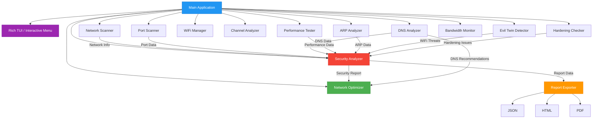

# Wif-G - Network Analyzer

```
╔══════════════════════════════════════════════════════════════╗
║                                                              ║
║     _   _      _                      _                      ║
║    | \ | | ___| |___      _____  _ __| | __                 ║
║    |  \| |/ _ \ __\ \ /\ / / _ \| '__| |/ /                 ║
║    | |\  |  __/ |_ \ V  V / (_) | |  |   <                  ║
║    |_| \_|\___|\__| \_/\_/ \___/|_|  |_|\_\                 ║
║        / \   _ __   __ _| |_   _ _______ _ __               ║
║       / _ \ | '_ \ / _` | | | | |_  / _ \ '__|              ║
║      / ___ \| | | | (_| | | |_| |/ /  __/ |                 ║
║     /_/   \_\_| |_|\__,_|_|\__, /___\___|_|                 ║
║                            |___/                             ║
║                                                              ║
║   Network Security Analysis and Optimization Tool v2.0      ║
║                                                              ║
╚══════════════════════════════════════════════════════════════╝
```

<div align="center">

[](https://www.python.org/downloads/)
[](LICENSE)
[](#-testing)
[](https://github.com/U-C4N/Wif-G/issues)
[](https://github.com/U-C4N/Wif-G/stargazers)
[](https://github.com/U-C4N/Wif-G)

**Advanced network security analyzer and optimizer for WiFi networks**

Scans ports, analyzes DNS, tests performance, detects threats, and provides security scoring with auto-optimization

[Features](#-features) | [What's New in v2.0](#-whats-new-in-v20) | [Installation](#-installation) | [Usage](#-usage) | [Documentation](#-documentation)

</div>

---

## What's New in v2.0

Version 2.0 brings **12 major new features** focused on advanced Windows support, security hardening, and a modern terminal interface:

- **Rich TUI Dashboard** - Beautiful terminal UI with tables, panels, and progress bars
- **Interactive Menu** - Arrow-key navigable menu system (`--interactive`)
- **PDF Report Export** - Professional PDF reports with `--export pdf`
- **ARP Spoofing Detection** - Detect man-in-the-middle attacks on your network
- **Evil Twin WiFi Detection** - Identify rogue access points with the same SSID
- **Process-to-Connection Mapping** - See which apps are using your network
- **SMB/RDP Hardening Check** - Audit Windows file sharing and remote desktop security
- **WiFi Profile Manager** - Analyze and clean saved WiFi profiles (WPA3/WPA2/WEP/Open)
- **WiFi Channel Analyzer** - Find the least congested WiFi channel
- **Windows TCP/IP Stack Optimization** - Tune Nagle, ECN, timestamps, RSS, auto-tuning
- **Per-Process Bandwidth Monitor** - Track bandwidth usage per application
- **MTU Optimization** - Auto-discover and set optimal MTU value

---

## Demo

<!-- GIF veya video eklemek icin buraya yerlestirin -->

> Network analysis and security scanning in action

---

## Features

### Network Information
- **WiFi Details**: SSID detection, signal strength monitoring (-50 to -70 dBm)
- **Network Interfaces**: Complete interface enumeration with IP/netmask
- **Gateway Detection**: Automatic router/gateway discovery
- **Network Statistics**: Real-time bytes sent/received, error tracking
- **Process Connections**: Map active network connections to running processes

### Port Scanner
- **High-Speed Scanning**: 200 concurrent threads for rapid port detection
- **Comprehensive Coverage**: 47+ common ports including critical services
- **Risk Assessment**: Automatic classification (Low/Medium/High/Critical)
- **Dangerous Port Detection**: Identifies Telnet(23), SMB(445), RDP(3389), etc.
- **Service Identification**: Maps ports to known services

### DNS Analysis
- **DNS Server Detection**: Identifies current nameservers
- **Response Time Testing**: Measures DNS query latency
- **Security Evaluation**: Detects ISP vs Public DNS (Cloudflare, Google, Quad9)
- **Privacy Warnings**: Alerts on potentially insecure DNS configurations
- **Smart Recommendations**: Suggests optimal DNS providers

### Performance Testing
- **Latency Measurement**: Multi-target ping tests (gateway, 8.8.8.8, 1.1.1.1)
- **Jitter Analysis**: Connection stability testing (samples: 20)
- **Packet Loss Detection**: 50-probe packet loss percentage
- **Bandwidth Estimation**: Download speed testing (customizable duration)
- **Per-Process Bandwidth**: Track which apps consume the most bandwidth
- **MTU Discovery**: Auto-detect optimal MTU to prevent fragmentation
- **Async Operations**: Non-blocking concurrent tests

### Security Analysis
- **Security Score**: 0-100 comprehensive rating system
- **Risk Categorization**: Critical/High/Medium/Low issue classification
- **Multi-Layer Checks**: Port security, DNS security, network health
- **ARP Spoofing Detection**: Detect MITM attacks via ARP table analysis
- **Evil Twin Detection**: Identify rogue access points mimicking your network
- **Process Monitoring**: Flag suspicious processes connecting to external servers
- **SMB/RDP Hardening**: Audit SMBv1 status, NLA, encryption, security layers
- **Actionable Recommendations**: Specific remediation steps for each issue

### WiFi Management
- **Profile Manager**: List, analyze, and clean saved WiFi profiles
- **Security Classification**: Rate profiles as WPA3 (safe), WPA2 (ok), WPA (weak), WEP/Open (dangerous)
- **Channel Analyzer**: Scan all nearby networks and analyze channel congestion
- **Channel Recommendation**: Suggest least congested non-overlapping channel (1, 6, 11)
- **Interference Scoring**: Calculate per-channel interference for 2.4GHz and 5GHz bands

### Network Optimization
- **Auto DNS Switching**: One-click change to fastest DNS (Cloudflare 1.1.1.1)
- **TCP/IP Stack Tuning**: Auto-tuning level, ECN, timestamps, RSS, chimney offload (Windows)
- **Nagle Algorithm Control**: Disable Nagle via Windows registry for lower latency
- **MTU Optimization**: Binary search for optimal MTU and auto-apply
- **DNS Cache Management**: Clear stale DNS records
- **Manual Recommendations**: Step-by-step guides for complex issues

### Modern Interface
- **Rich TUI Dashboard**: Beautiful tables, panels, progress bars via `rich` library
- **Interactive Menu**: Arrow-key navigation with `questionary` (`--interactive` mode)
- **PDF Reports**: Professional PDF export with colored risk levels and tables
- **Multiple Export Formats**: JSON, HTML, and PDF report generation
- **Colorama Fallback**: Graceful degradation if `rich` is not installed

---

## Requirements

- **Python**: 3.11 or higher
- **Operating System**: Windows 10/11, Linux (Ubuntu, Debian, Fedora, Arch)
- **Privileges**: Admin/sudo access for full functionality
- **Core Dependencies**:
  - `colorama` - Colored terminal output (fallback)
  - `netifaces` - Network interface information
  - `psutil` - System and process utilities
  - `pyyaml` - Configuration file parsing
  - `rich` - Modern terminal UI
  - `questionary` - Interactive terminal menus
  - `reportlab` - PDF report generation

---

## Installation

### Quick Install

```bash
# Clone the repository
git clone https://github.com/U-C4N/Wif-G.git
cd Wif-G

# Install dependencies
pip install -r requirements.txt

# Run (Linux)
sudo python3 main.py

# Run (Windows - as Administrator)
python main.py
```

### Virtual Environment (Recommended)

```bash
# Create virtual environment
python -m venv venv

# Activate (Linux/macOS)
source venv/bin/activate

# Activate (Windows)
venv\Scripts\activate

# Install dependencies
pip install -r requirements.txt

# Run
python main.py
```

### Development Setup

```bash
# Install dev dependencies
pip install -r requirements-dev.txt

# Run tests
python -m pytest tests/ -v

# Check code style
flake8 src/
black src/
```

---

## Usage

### Basic Scan

```bash
# Full analysis (all modules)
python main.py

# Interactive mode with arrow-key menu
python main.py --interactive
```

### Selective Scanning

```bash
python main.py --scan-only network       # Network scan only
python main.py --scan-only dns           # DNS analysis only
python main.py --scan-only ports         # Port scan only
python main.py --scan-only performance   # Performance test only
python main.py --scan-only security      # Security analysis only
```

### Export & History

```bash
python main.py --export json             # Export as JSON
python main.py --export html             # Export as HTML
python main.py --export pdf              # Export as PDF
python main.py --export-dir ./reports    # Custom export path
python main.py --save                    # Save to history database
python main.py --history                 # Show scan history
python main.py --compare                 # Compare with previous scan
```

### Configuration

```bash
python main.py --config custom.yaml      # Use custom config
python main.py --verbose                 # Debug output
python main.py --no-optimize             # Skip optimization suggestions
```

### Interactive Mode

Launch with `--interactive` or `-i` for a menu-driven experience:

```
python main.py -i
```

Menu options:
- Full Scan
- Select Scan Types (multi-select: Network, DNS, Performance, Ports, Security)
- View Scan History
- Export Report (JSON/HTML/PDF)
- Optimize Network
- Exit

### Why Admin/Sudo?

Many network operations require elevated privileges:
- Port scanning and network interface enumeration
- DNS and TCP configuration changes
- Registry access for Windows optimizations (Nagle, SMB/RDP checks)
- System-level network statistics

**Without admin**: The tool runs in limited mode with reduced functionality.

### Privacy Note

When sharing screenshots or output:
- **Safe to share**: Private IP addresses (192.168.x.x, 10.x.x.x, 172.16-31.x.x)
- **Consider masking**: Interface GUIDs (Windows)
- **Never share**: Public IP addresses, MAC addresses, WiFi passwords, or any PII

---

## Documentation

### Architecture



### Module Overview

| Module | Description |
|--------|-------------|
| `network_scanner.py` | Network interface scanning, WiFi info, gateway detection, process connections |
| `port_scanner.py` | Concurrent port scanning with risk assessment |
| `dns_analyzer.py` | DNS server detection, response timing, provider identification |
| `performance_tester.py` | Async latency, jitter, packet loss, bandwidth testing |
| `security_analyzer.py` | Security scoring, issue detection, risk categorization |
| `optimizer.py` | DNS switching, TCP/IP tuning (Windows + Linux), MTU optimization |
| `wifi_manager.py` | WiFi profile listing, security classification, profile cleanup |
| `channel_analyzer.py` | WiFi channel scanning, interference scoring, channel recommendation |
| `arp_analyzer.py` | ARP table analysis, spoofing detection, gateway MAC monitoring |
| `evil_twin_detector.py` | Rogue AP detection, Evil Twin identification, signal anomaly analysis |
| `hardening_checker.py` | SMB/RDP security auditing via registry and PowerShell |
| `bandwidth_monitor.py` | Per-process bandwidth monitoring with periodic sampling |
| `cli.py` | Rich TUI dashboard with panels, tables, progress bars |
| `report_exporter.py` | JSON, HTML, and PDF report generation |
| `config.py` | YAML configuration management |
| `database.py` | SQLite scan history storage |
| `history.py` | Scan history management and comparison |
| `app.py` | Core business logic engine and orchestration |

---

## Screenshots

### Port Scan with Risk Assessment


### Security Analysis Report


### Optimization Suggestions


---

## Project Structure

```
Wif-G/
├── main.py                              # Entry point + interactive mode
├── pyproject.toml                       # Project configuration
├── requirements.txt                     # Python dependencies
├── requirements-dev.txt                 # Development dependencies
├── config.example.yaml                  # Configuration template
├── README.md                            # This file
├── LICENSE                              # MIT License
├── CHANGELOG.md                         # Version history
├── CONTRIBUTING.md                      # Contribution guidelines
├── SECURITY.md                          # Security policy
│
├── src/network_analyzer/
│   ├── __init__.py                      # Package exports
│   ├── app.py                           # Core business logic engine
│   ├── cli.py                           # Rich TUI dashboard
│   ├── config.py                        # Configuration management
│   ├── database.py                      # SQLite operations
│   ├── history.py                       # Scan history management
│   ├── report_exporter.py              # JSON/HTML/PDF export
│   │
│   ├── network_scanner.py              # Network info + process connections
│   ├── port_scanner.py                 # Port scanning engine
│   ├── dns_analyzer.py                 # DNS analysis module
│   ├── performance_tester.py           # Async performance testing
│   ├── security_analyzer.py            # Security assessment engine
│   ├── optimizer.py                    # Network optimizer (DNS/TCP/MTU)
│   │
│   ├── wifi_manager.py                 # WiFi profile manager
│   ├── channel_analyzer.py             # WiFi channel analyzer
│   ├── arp_analyzer.py                 # ARP spoofing detector
│   ├── evil_twin_detector.py           # Evil Twin WiFi detector
│   ├── hardening_checker.py            # SMB/RDP hardening checker
│   └── bandwidth_monitor.py            # Per-process bandwidth monitor
│
├── tests/
│   ├── test_network_scanner.py          # Network scanner tests
│   ├── test_port_scanner.py             # Port scanner tests
│   ├── test_dns_analyzer.py             # DNS analyzer tests
│   ├── test_performance_tester.py       # Performance tester tests
│   ├── test_security_analyzer.py        # Security analyzer tests
│   ├── test_optimizer.py                # Optimizer tests (TCP/MTU)
│   ├── test_wifi_manager.py             # WiFi manager tests
│   ├── test_channel_analyzer.py         # Channel analyzer tests
│   ├── test_arp_analyzer.py             # ARP analyzer tests
│   ├── test_evil_twin_detector.py       # Evil Twin detector tests
│   ├── test_hardening_checker.py        # Hardening checker tests
│   ├── test_process_connections.py      # Process connection tests
│   └── test_bandwidth_monitor.py        # Bandwidth monitor tests
│
├── screenshots/                         # Demo screenshots
└── .github/                             # CI/CD workflows & templates
```

---

## Testing

Run the full test suite (187 tests):

```bash
python -m pytest tests/ -v
```

Run specific test modules:

```bash
python -m pytest tests/test_wifi_manager.py -v        # WiFi manager (18 tests)
python -m pytest tests/test_channel_analyzer.py -v     # Channel analyzer (14 tests)
python -m pytest tests/test_arp_analyzer.py -v         # ARP analyzer (9 tests)
python -m pytest tests/test_evil_twin_detector.py -v   # Evil Twin (9 tests)
python -m pytest tests/test_hardening_checker.py -v    # Hardening (12 tests)
python -m pytest tests/test_process_connections.py -v  # Process mapping (11 tests)
python -m pytest tests/test_bandwidth_monitor.py -v    # Bandwidth monitor (12 tests)
python -m pytest tests/test_optimizer.py -v            # Optimizer (31 tests)
```

Run with coverage:

```bash
python -m pytest tests/ --cov=src/network_analyzer --cov-report=html
```

---

## Configuration

Copy `config.example.yaml` and customize:

```yaml
port_scanner:
  max_workers: 50           # Concurrent scanning threads (1-200)
  timeout: 1.0              # Socket timeout in seconds
  scan_type: common         # common | quick | range

dns_analyzer:
  timeout: 3.0              # DNS query timeout
  preferred_dns:
    - 1.1.1.1
    - 8.8.8.8

performance:
  latency_samples: 10       # Ping samples
  jitter_samples: 20        # Jitter test samples
  packet_loss_probes: 50    # Packet loss probes
  bandwidth_duration: 5     # Speed test duration (seconds)

security:
  signal_weak_dbm: -70      # Weak signal threshold
  latency_high_ms: 100      # High latency threshold
  packet_loss_high_pct: 5   # High packet loss threshold

logging:
  level: INFO               # DEBUG | INFO | WARNING | ERROR
```

---

## Roadmap

- [x] Windows support with PowerShell integration
- [x] Export reports (JSON, HTML, PDF)
- [x] Database integration for historical data
- [x] Rich TUI dashboard
- [x] Interactive terminal menu
- [x] ARP spoofing detection
- [x] Evil Twin WiFi detection
- [x] WiFi profile management
- [x] WiFi channel analysis
- [x] TCP/IP stack optimization (Windows)
- [x] Per-process bandwidth monitoring
- [x] MTU optimization
- [ ] macOS support with native tools
- [ ] Web-based dashboard (Flask/FastAPI)
- [ ] Scheduled scans with cron/Task Scheduler
- [ ] Email notifications for security alerts
- [ ] Machine learning for anomaly detection
- [ ] IPv6 support
- [ ] VPN detection and analysis

---

## Contributing

Contributions are welcome! See [CONTRIBUTING.md](CONTRIBUTING.md) for guidelines.

### Quick Start

1. Fork the repository
2. Create a feature branch (`git checkout -b feature/AmazingFeature`)
3. Commit changes (`git commit -m 'Add AmazingFeature'`)
4. Push to branch (`git push origin feature/AmazingFeature`)
5. Open a Pull Request

---

## Disclaimer

This tool is intended for **educational purposes** and **network administration** on networks you own or have permission to test.

**Important Notes:**
- Do not scan networks without authorization
- Port scanning may trigger security alerts
- Some ISPs may flag scanning activities
- Use responsibly and ethically

The authors assume no liability for misuse of this tool.

---

## License

This project is licensed under the **MIT License** - see the [LICENSE](LICENSE) file for details.

---

## Author

**U-C4N**

- GitHub: [@U-C4N](https://github.com/U-C4N)
- Project: [Wif-G](https://github.com/U-C4N/Wif-G)

---

## Acknowledgments

- **Rich** - Beautiful terminal formatting
- **Questionary** - Interactive terminal menus
- **ReportLab** - PDF generation
- **psutil** - System and process monitoring
- **netifaces** - Network interface detection
- **Colorama** - Cross-platform colored output

Special thanks to the open-source community for making tools like this possible.

---

<div align="center">

**Star this repository if you find it helpful!**

Made with by [U-C4N](https://github.com/U-C4N)

</div>
