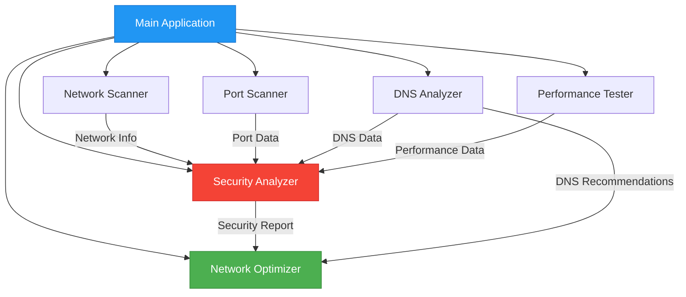
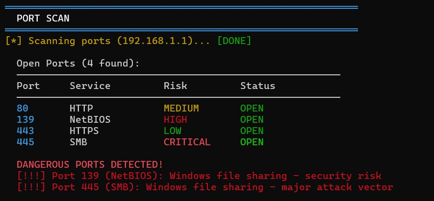
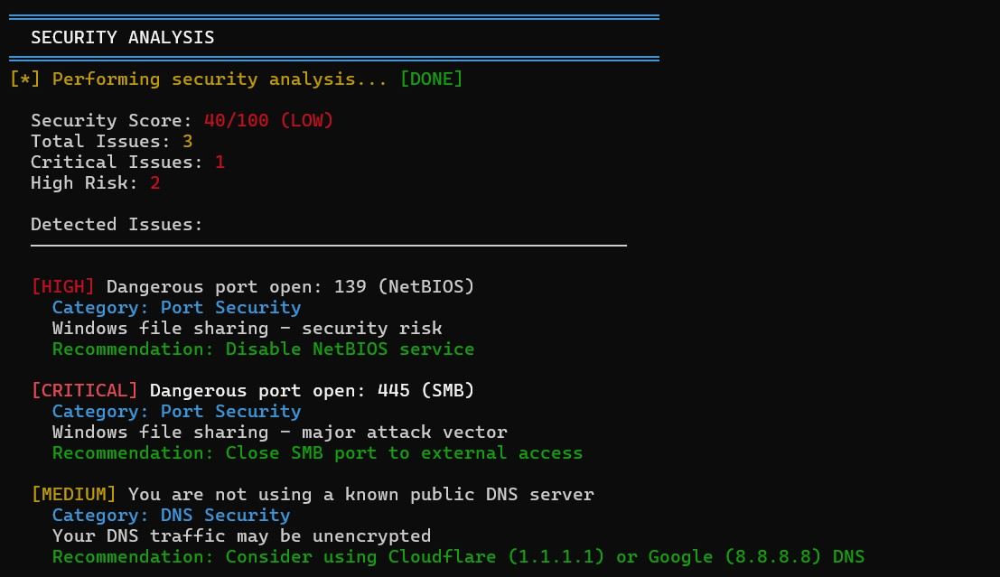
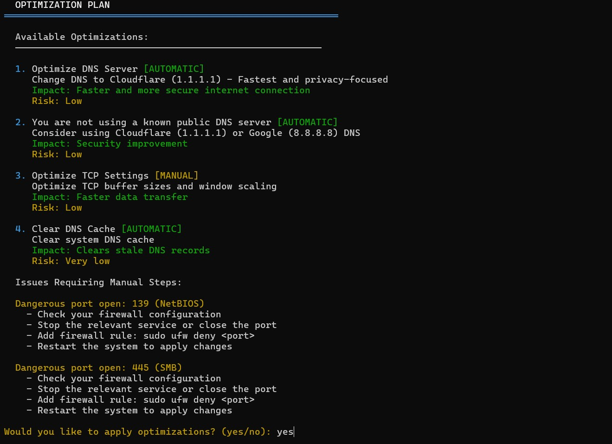

# Wif-G - Network Analyzer

```
╔══════════════════════════════════════════════════════════════╗
║                                                              ║
║     _   _      _                      _                      ║
║    | \ | | ___| |___      _____  _ __| | __                 ║
║    |  \| |/ _ \ __\ \ /\ / / _ \| '__| |/ /                 ║
║    | |\  |  __/ |_ \ V  V / (_) | |  |   <                  ║
║    |_| \_|\___|\__| \_/\_/ \___/|_|  |_|\_\                 ║
║        / \   _ __   __ _| |_   _ _______ _ __               ║
║       / _ \ | '_ \ / _` | | | | |_  / _ \ '__|              ║
║      / ___ \| | | | (_| | | |_| |/ /  __/ |                 ║
║     /_/   \_\_| |_|\__,_|_|\__, /___\___|_|                 ║
║                            |___/                             ║
║                                                              ║
║   Network Security Analysis and Optimization Tool v1.0      ║
║                                                              ║
╚══════════════════════════════════════════════════════════════╝
```

<div align="center">

[](https://www.python.org/downloads/)
[](LICENSE)
[](https://github.com/U-C4N/Wif-G/issues)
[](https://github.com/U-C4N/Wif-G/stargazers)
[](https://github.com/U-C4N/Wif-G)

**Advanced network security analyzer and optimizer for WiFi networks**

Scans ports, analyzes DNS, tests performance, and provides security scoring with auto-optimization

[Features](#-features) • [Installation](#-installation) • [Usage](#-usage) • [Documentation](#-documentation)

</div>

---

## 🎬 Demo

<!-- GIF veya video eklemek için buraya yerleştirin -->

> Network analysis and security scanning in action

---

## ✨ Features

### 🌐 Network Information
- **WiFi Details**: SSID detection, signal strength monitoring (-50 to -70 dBm)
- **Network Interfaces**: Complete interface enumeration with IP/netmask
- **Gateway Detection**: Automatic router/gateway discovery
- **Network Statistics**: Real-time bytes sent/received, error tracking

### 🔍 Port Scanner
- **High-Speed Scanning**: 200 concurrent threads for rapid port detection
- **Comprehensive Coverage**: 47+ common ports including critical services
- **Risk Assessment**: Automatic classification (Low/Medium/High/Critical)
- **Dangerous Port Detection**: Identifies Telnet(23), SMB(445), RDP(3389), etc.
- **Service Identification**: Maps ports to known services

### 🛡️ DNS Analysis
- **DNS Server Detection**: Identifies current nameservers
- **Response Time Testing**: Measures DNS query latency
- **Security Evaluation**: Detects ISP vs Public DNS (Cloudflare, Google, Quad9)
- **Privacy Warnings**: Alerts on potentially insecure DNS configurations
- **Smart Recommendations**: Suggests optimal DNS providers

### ⚡ Performance Testing
- **Latency Measurement**: Multi-target ping tests (gateway, 8.8.8.8, 1.1.1.1)
- **Jitter Analysis**: Connection stability testing (samples: 20)
- **Packet Loss Detection**: 50-probe packet loss percentage
- **Bandwidth Estimation**: Download speed testing (customizable duration)
- **Async Operations**: Non-blocking concurrent tests

### 🔐 Security Analysis
- **Security Score**: 0-100 comprehensive rating system
- **Risk Categorization**: Critical/High/Medium/Low issue classification
- **Multi-Layer Checks**: Port security, DNS security, network health
- **Automated Scanning**: Detects open dangerous ports, weak WiFi signals
- **Actionable Recommendations**: Specific remediation steps for each issue

### 🚀 Network Optimization
- **Auto DNS Switching**: One-click change to fastest DNS (Cloudflare 1.1.1.1)
- **TCP Optimization**: Buffer size tuning, window scaling
- **DNS Cache Management**: Clear stale DNS records
- **Manual Recommendations**: Step-by-step guides for complex issues
- **Root/Non-Root Support**: Graceful degradation for limited permissions

---

## 📋 Requirements

- **Python**: 3.11 or higher
- **Operating System**: Linux (Ubuntu, Debian, Fedora, Arch)
- **Privileges**: `sudo` access for full functionality
- **Dependencies**:
  - `colorama` - Colored terminal output
  - `netifaces` - Network interface information
  - `psutil` - System and process utilities
  - `python-nmap` - Port scanning capabilities

---

## 🔧 Installation

### Quick Install

```bash
# Clone the repository
git clone https://github.com/U-C4N/Wif-G.git
cd Wif-G

# Install dependencies
pip install colorama netifaces psutil python-nmap

# Run with sudo
sudo python3 main.py
```

### Alternative: Virtual Environment

```bash
# Create virtual environment
python3 -m venv venv
source venv/bin/activate  # On Windows: venv\Scripts\activate

# Install dependencies
pip install -r requirements.txt

# Run
sudo venv/bin/python main.py
```

### System Requirements Check

```bash
# Verify Python version
python3 --version  # Should be 3.11+

# Check if sudo is available
sudo -v
```

---

## 🚀 Usage

### Basic Scan

Simply run the tool with sudo privileges:

```bash
sudo python3 main.py
```

The tool will automatically:
1. Scan your network information
2. Analyze DNS configuration
3. Run performance tests
4. Scan for open ports
5. Generate security report
6. Suggest optimizations

### Sample Output

```
╔══════════════════════════════════════════════════════════════╗
║                   NETWORK INFORMATION                        ║
╚══════════════════════════════════════════════════════════════╝

[*] Scanning network... [DONE]
  WiFi SSID: MyNetwork-5G
  Signal Strength: -42 dBm (Excellent)
  Local IP: 192.168.1.15
  Gateway: 192.168.1.1

╔══════════════════════════════════════════════════════════════╗
║                     DNS ANALYSIS                             ║
╚══════════════════════════════════════════════════════════════╝

  Current DNS Servers:
    1.1.1.1 (Cloudflare) - [PUBLIC DNS] - 12ms
    8.8.8.8 (Google) - [PUBLIC DNS] - 18ms

╔══════════════════════════════════════════════════════════════╗
║                  SECURITY ANALYSIS                           ║
╚══════════════════════════════════════════════════════════════╝

  Security Score: 85/100 (GOOD)
  Total Issues: 2
  Critical Issues: 0
  High Risk: 1
```

### Why Sudo?

Many network operations require elevated privileges:
- Port scanning
- Network interface enumeration
- DNS configuration changes
- TCP kernel parameter tuning
- System-level network statistics

**Without sudo**: The tool will run in limited mode with reduced functionality.

### ⚠️ Privacy Note

When sharing screenshots or output:
- **Safe to share**: Private IP addresses (192.168.x.x, 10.x.x.x, 172.16-31.x.x) - these are local network addresses
- **Consider masking**: Interface GUIDs (Windows) - system-specific identifiers
- **Never share**: Public IP addresses, MAC addresses, or any personally identifiable information

The tool does **not** display MAC addresses or public IPs by default.

---

## 📊 Documentation

### Architecture



### Module Overview

#### 1. Network Scanner (`network_scanner.py`)
- Scans all network interfaces
- Detects WiFi SSID and signal strength
- Identifies gateway and local IP
- Collects network statistics

**Key Methods:**
- `scan()` - Full network scan
- `get_network_stats()` - Traffic statistics
- `get_active_connections()` - Current connections

#### 2. Port Scanner (`port_scanner.py`)
- Concurrent port scanning (200 workers)
- Pre-defined dangerous port list
- Service identification

**Key Features:**
- 47 common ports mapped
- Risk level assignment
- Targeted recommendations

#### 3. DNS Analyzer (`dns_analyzer.py`)
- Detects current DNS servers
- Measures response times
- Identifies public vs ISP DNS

**Key Features:**
- DNS query builder
- Response time measurement
- Security recommendations

#### 4. Performance Tester (`performance_tester.py`)
- Async latency testing
- Jitter calculation
- Packet loss measurement
- Bandwidth estimation

**Key Methods:**
- `latency_test()` - Multi-target ping
- `jitter_test()` - Connection stability
- `packet_loss_test()` - Loss percentage
- `bandwidth_estimate()` - Speed test

#### 5. Security Analyzer (`security_analyzer.py`)
- Aggregates all scan results
- Calculates security score
- Generates prioritized issue list

**Risk Levels:**
- `CRITICAL`: Immediate action required (30 points deduction)
- `HIGH`: Serious vulnerability (20 points)
- `MEDIUM`: Notable concern (10 points)
- `LOW`: Minor issue (5 points)

#### 6. Network Optimizer (`optimizer.py`)
- Applies automated fixes
- Provides manual recommendations
- Changes DNS settings
- Optimizes TCP parameters

---

## 🎨 Screenshots

### Port Scan with Risk Assessment


### Security Analysis Report


### Optimization Suggestions


---

## 🛠️ Project Structure

```
Wif-G/
├── main.py                          # Main application entry point
├── pyproject.toml                   # Project configuration
├── README.md                        # This file
├── LICENSE                          # License file
├── requirements.txt                 # Python dependencies
│
└── src/
    └── network_analyzer/
        ├── __init__.py              # Package initialization
        ├── network_scanner.py       # Network information gatherer
        ├── port_scanner.py          # Port scanning engine
        ├── dns_analyzer.py          # DNS analysis module
        ├── performance_tester.py    # Performance testing suite
        ├── security_analyzer.py     # Security assessment engine
        └── optimizer.py             # Network optimization module
```

---

## 🤝 Contributing

Contributions are welcome! Here's how you can help:

### Reporting Bugs
1. Check existing [Issues](https://github.com/U-C4N/Wif-G/issues)
2. Create a new issue with:
   - Clear title
   - Steps to reproduce
   - Expected vs actual behavior
   - System information (OS, Python version)

### Feature Requests
1. Open an issue with `[Feature Request]` tag
2. Describe the feature and use case
3. Explain expected behavior

### Pull Requests
1. Fork the repository
2. Create a feature branch (`git checkout -b feature/AmazingFeature`)
3. Commit changes (`git commit -m 'Add AmazingFeature'`)
4. Push to branch (`git push origin feature/AmazingFeature`)
5. Open a Pull Request

### Development Setup

```bash
# Clone your fork
git clone https://github.com/U-C4N/Wif-G.git
cd Wif-G

# Create virtual environment
python3 -m venv venv
source venv/bin/activate

# Install dev dependencies
pip install -r requirements-dev.txt

# Run tests
python -m pytest tests/

# Check code style
flake8 src/
black src/
```

---

## 📝 Roadmap

- [ ] Windows support with PowerShell integration
- [ ] macOS support with native tools
- [ ] Web-based dashboard (Flask/FastAPI)
- [ ] Export reports (JSON, CSV, PDF)
- [ ] Scheduled scans with cron integration
- [ ] Email notifications for security alerts
- [ ] Database integration for historical data
- [ ] Machine learning for anomaly detection
- [ ] IPv6 support
- [ ] VPN detection and analysis

---

## ⚠️ Disclaimer

This tool is intended for **educational purposes** and **network administration** on networks you own or have permission to test. 

**Important Notes:**
- Do not scan networks without authorization
- Port scanning may trigger security alerts
- Some ISPs may flag scanning activities
- Use responsibly and ethically

The authors assume no liability for misuse of this tool.

---

## 📄 License

This project is licensed under the **MIT License** - see the [LICENSE](LICENSE) file for details.

```
MIT License

Copyright (c) 2025 U-C4N

Permission is hereby granted, free of charge, to any person obtaining a copy
of this software and associated documentation files (the "Software"), to deal
in the Software without restriction, including without limitation the rights
to use, copy, modify, merge, publish, distribute, sublicense, and/or sell
copies of the Software, and to permit persons to whom the Software is
furnished to do so, subject to the following conditions:

The above copyright notice and this permission notice shall be included in all
copies or substantial portions of the Software.

THE SOFTWARE IS PROVIDED "AS IS", WITHOUT WARRANTY OF ANY KIND, EXPRESS OR
IMPLIED, INCLUDING BUT NOT LIMITED TO THE WARRANTIES OF MERCHANTABILITY,
FITNESS FOR A PARTICULAR PURPOSE AND NONINFRINGEMENT.
```

---

## 👤 Author

**U-C4N**

- GitHub: [@U-C4N](https://github.com/U-C4N)
- Project: [Wif-G](https://github.com/U-C4N/Wif-G)

---

## 🙏 Acknowledgments

- **Colorama** - Cross-platform colored terminal output
- **psutil** - System and process monitoring
- **netifaces** - Network interface detection
- **python-nmap** - Nmap integration for Python

Special thanks to the open-source community for making tools like this possible.

---

## 📊 Statistics


---

<div align="center">

**⭐ Star this repository if you find it helpful!**

Made with ❤️ by [U-C4N](https://github.com/U-C4N)

</div>
